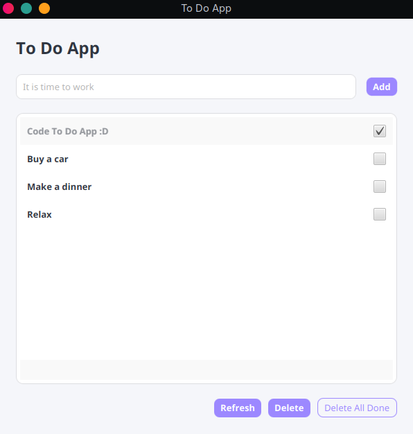

#  Fast Cloud Todo App

## 🛠 Tech Stack
* **Java** (Core logic)
* **JavaFX** (GUI / Interface)
* **Maven** (Build & Dependency Management)
* **MySQL via Aiven** (Cloud Database)

##  Under the Hood (Why it feels so fast)
To make this app feel seamless, I implemented a few key architectural choices:

* **Optimistic UI:** When you add, complete, or delete a task, the interface updates *instantly*. You don't have to wait for the server to respond – it feels like a local app, but handles everything securely in the background.
* **Multithreading:** All heavy database operations (fetching, inserting, deleting) are strictly separated from the main UI thread. They run in the background, ensuring the window never freezes or hangs.
* **Cloud Sync:** Tasks are stored in a remote MySQL database hosted on Aiven, so your data is always safe and accessible.

## How to run it locally

 1. **Clone the repository:**
   `git clone https://github.com/YourUsername/YourRepoName.git`

2. **Set up the Database connection:**
   * Navigate to `src/main/resources/`.
   * You will find a file named `db.properties.example`. Rename it to `db.properties`.
   * Open it and fill in your own MySQL database credentials (url, user, password). 
   * *Note: `db.properties` is ignored by Git for security reasons.*

3. **Run the app:**
   You don't even need to have Maven installed globally. Just use the included Maven Wrapper in your terminal:
   
   **On Linux/Mac:**
   `./mvnw clean javafx:run`
   
   **On Windows:**
   `mvnw.cmd clean javafx:run`